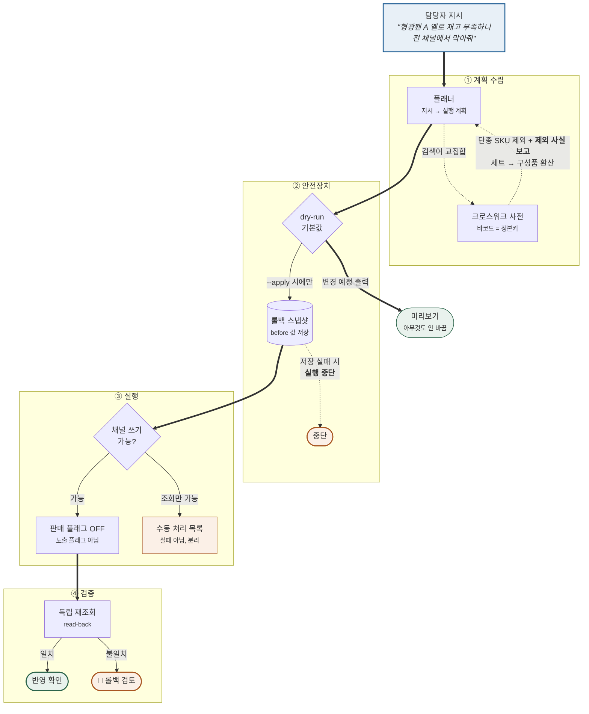
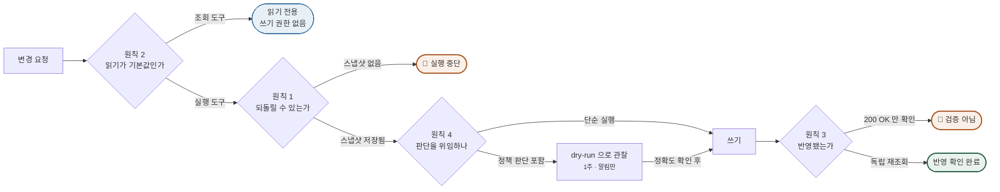
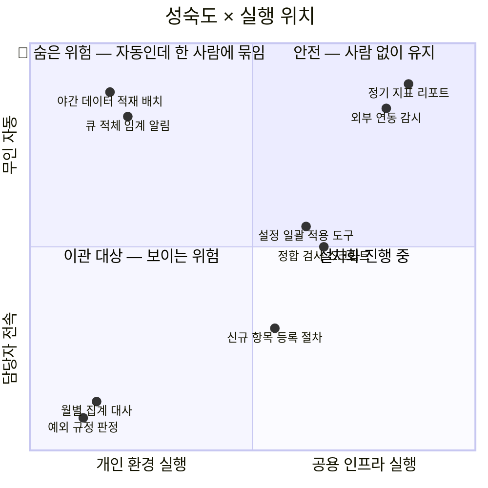
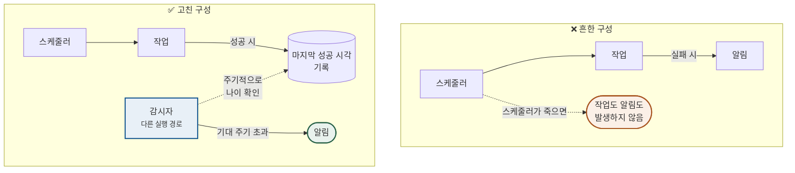

# 아키텍처 다이어그램

말로 설명하면 세 문단이 필요한 것을 한 장으로 보여주는 그림만 모았습니다.
GitHub 에서 바로 렌더링됩니다.

---

## 1. 멀티채널 재고 오케스트레이션 — 전체 구조

자연어 지시 한 줄이 여러 채널의 판매 상태로 도달하기까지.
**굵은 화살표가 실행 경로, 점선이 안전장치입니다.**

**설계 판단 4가지**

| 지점 | 왜 이렇게 했나 |
|---|---|
| 바코드를 정본키로 | 상품명 매칭은 구형·리뉴얼 버전을 혼동해 엉뚱한 옵션을 차단한다 |
| 검색어를 **교집합**으로 | 합집합이면 "형광펜 A 옐로"가 형광펜 A 전 색상을 잡아, 팔 수 있는 재고까지 막는다 |
| 노출이 아니라 **판매 플래그** | 품절 표시만으로는 실제 주문이 막히지 않는 채널이 있다 |
| 쓰기 불가 채널은 **분리** | 실패로 처리하면 전체가 실패한다. 수동 대상으로 넘겨야 나머지가 진행된다 |

---

## 2. 안전 설계 4원칙 — 실행 순서로 본 배치

원칙이 코드의 어느 지점에 박히는지.

---

## 3. 성숙도 프레임워크 — 두 축이 독립인 이유

성숙도만 보면 놓치는 구간이 있습니다.

**2사분면이 이 프레임워크를 만든 이유입니다.**
`무인 자동`으로 분류돼 성숙도 지표를 올려주지만, 실제로는 담당자 한 명에게 묶여 있습니다.
축을 하나만 쓰면 **이 구간이 성과로 집계**됩니다.

→ 측정 도구: [`tools/maturity`](../../tools/maturity/) — CSV 를 넣으면 이 구간을 자동으로 뽑아냅니다.

---

## 4. 조용한 실패 탐지 — 감시자를 어디에 두는가

**핵심은 두 가지입니다.**
① 실패가 아니라 **마지막 성공 시각의 나이**를 감시한다 — 실행이 없으면 실패도 없으므로
② 감시자를 **감시 대상과 다른 실행 경로**에 둔다 — 같은 스케줄러 위에 있으면 함께 죽는다
